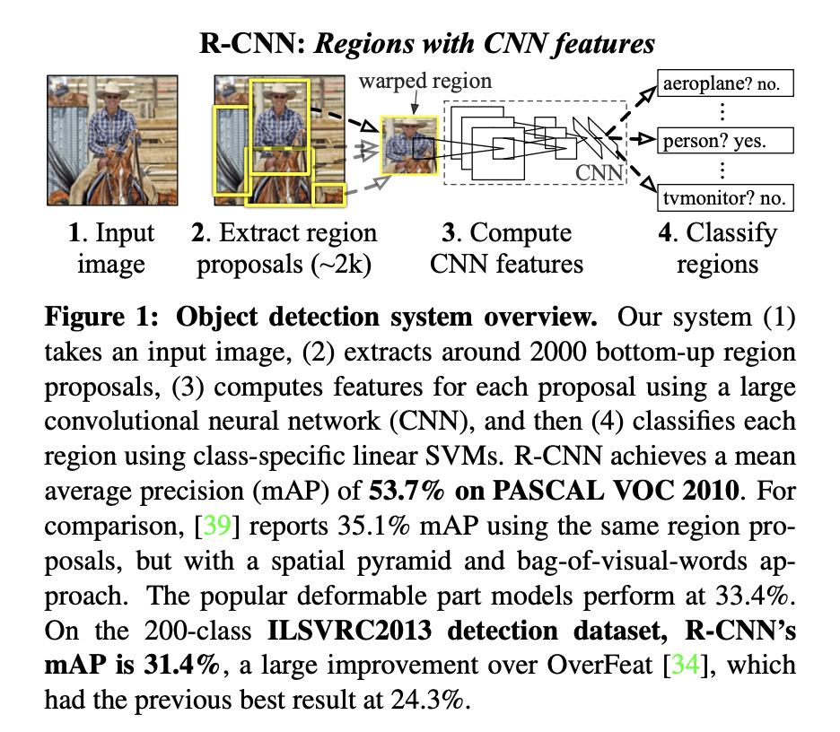
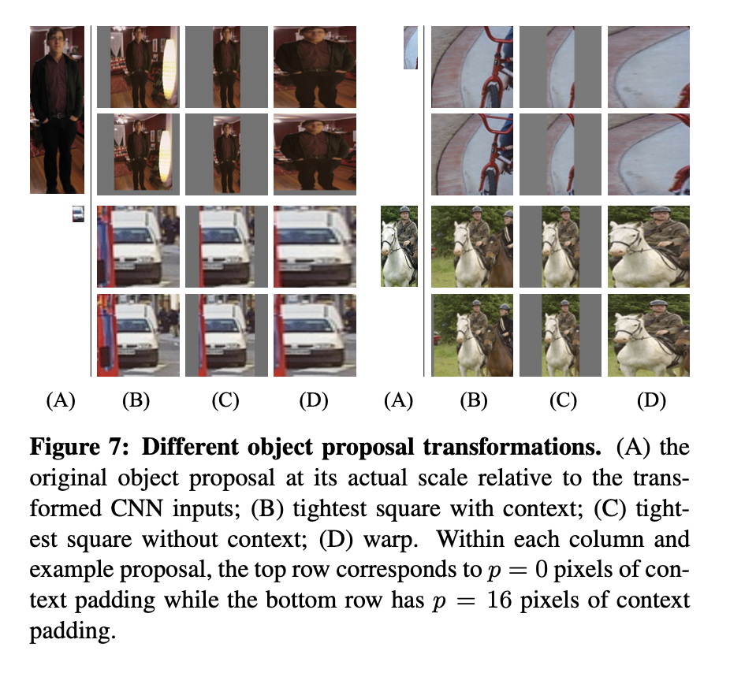
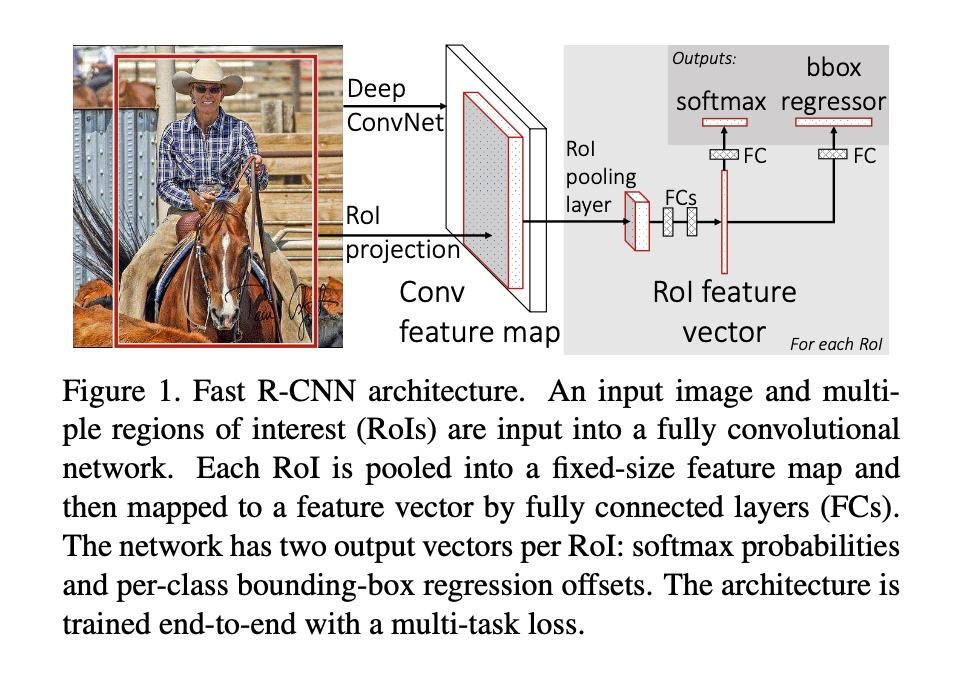
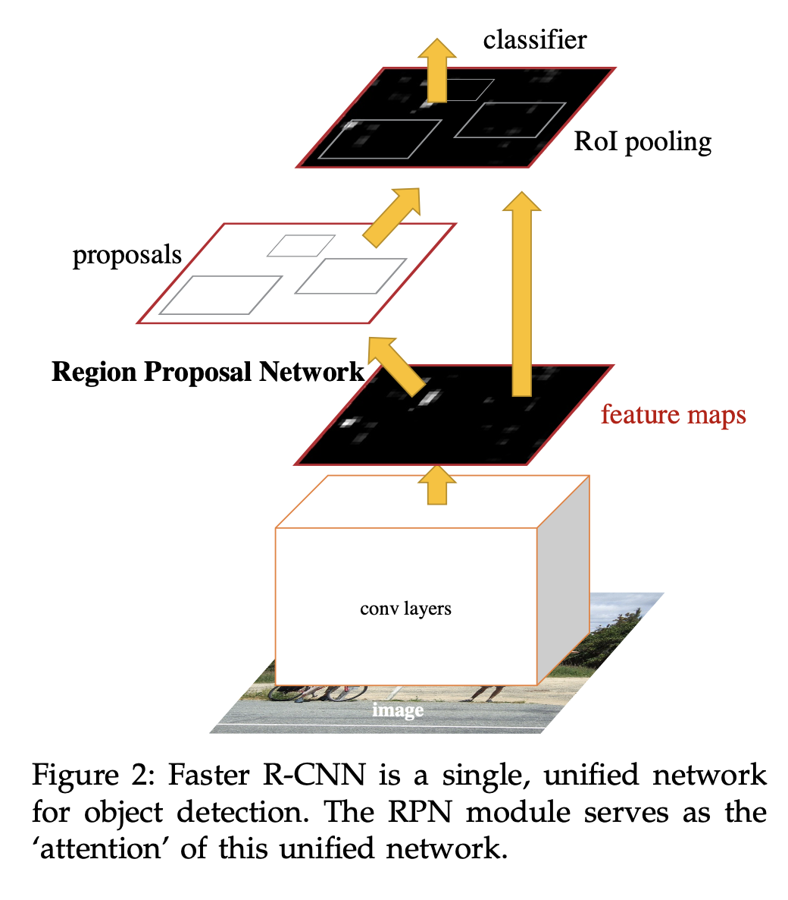

# RCNN series

## Rich feature hierarchies for accurate object detection and semantic segmentation
- region with CNN features，深度学习解决工业目标检测的开山，CVPR2014
- IOU，Interaction over Union，交并比
- NMS，Non-Maximum Suppression，非极大值抑制

- 整体步骤
    - 输入一张图片
    - 提取大约2000个物体区域候选框
    - 利用CNN计算每个候选框的特征
    - 利用线性SVM分类

- 区域候选框
    - 当我们输入一张图片时，我们要搜索出所有可能是物体的区域，这个采用的方法是传统文献的算法：《search for object recognition》，通过这个算法我们搜索出2000个候选框。然后从上面的总流程图中可以看到，搜出的候选框是矩形的，而且是大小各不相同。然而CNN对输入图片的大小是有固定的，如果把搜索到的矩形选框不做处理，就扔进CNN中，肯定不行。因此对于每个输入的候选框都需要缩放到固定的大小。下面我们讲解要怎么进行缩放处理，为了简单起见我们假设下一阶段CNN所需要的输入图片大小是个正方形图片227*227。因为我们经过selective search 得到的是矩形框，paper试验了几种不同的处理方法。

- CNN
- 网络结构设计阶段
    - 网络架构我们有两个可选方案：第一选择经典的Alexnet；第二选择VGG16。经过测试Alexnet精度为58.5%，VGG16精度为66%。VGG这个模型的特点是选择比较小的卷积核、选择较小的跨步，这个网络的精度高，不过计算量是Alexnet的7倍。后面为了简单起见，我们就直接选用Alexnet，并进行讲解；Alexnet特征提取部分包含了5个卷积层、2个全连接层，在Alexnet中p5层神经元个数为9216、 f6、f7的神经元个数都是4096，通过这个网络训练完毕后，最后提取特征每个输入候选框图片都能得到一个4096维的特征向量。
- 网络有监督预训练阶段
    - 参数初始化部分：物体检测的一个难点在于，物体标签训练数据少，如果要直接采用随机初始化CNN参数的方法，那么目前的训练数据量是远远不够的。这种情况下，最好的是采用某些方法，把参数初始化了，然后在进行有监督的参数微调，这边文献采用的是有监督的预训练。所以paper在设计网络结构的时候，是直接用Alexnet的网络，然后连参数也是直接采用它的参数，作为初始的参数值，然后再fine-tuning训练。
    - 网络优化求解：采用随机梯度下降法，学习速率大小为0.001；
- fine-tuning阶段
    - 我们接着采用selective search 搜索出来的候选框，然后处理到指定大小图片，继续对上面预训练的cnn模型进行fine-tuning训练。假设要检测的物体类别有N类，那么我们就需要把上面预训练阶段的CNN模型的最后一层给替换掉，替换成N+1个输出的神经元(加1，表示还有一个背景)，然后这一层直接采用参数随机初始化的方法，其它网络层的参数不变；接着就可以开始继续SGD训练了。开始的时候，SGD学习率选择0.001，在每次训练的时候，我们batch size大小选择128，其中32个正样本、96个负样本（正负样本的定义前面已经提过，不再解释）。

## Fast RCNN
- 之所以提出Fast R-CNN，主要是因为R-CNN存在以下几个问题：1、训练分多步。R-CNN的训练先要fine tuning一个预训练的网络，然后针对每个类别都训练一个SVM分类器，最后还要用regressors对bounding-box进行回归，另外region proposal也要单独用selective search的方式获得，步骤比较繁琐。2、时间和内存消耗比较大。在训练SVM和回归的时候需要用网络训练的特征作为输入，特征保存在磁盘上再读入的时间消耗还是比较大的。3、测试的时候也比较慢，每张图片的每个region proposal都要做卷积，重复操作太多。
- 虽然在Fast RCNN之前有提出过SPPnet算法来解决RCNN中重复卷积的问题，但是SPPnet依然存在和RCNN一样的一些缺点比如：训练步骤过多，需要训练SVM分类器，需要额外的回归器，特征也是保存在磁盘上。因此Fast RCNN相当于全面改进了原有的这两个算法，不仅训练步骤减少了，也不需要额外将特征保存在磁盘上。
- 基于VGG16的Fast RCNN算法在训练速度上比RCNN快了将近9倍，比SPPnet快大概3倍；测试速度比RCNN快了213倍，比SPPnet快了10倍。在VOC2012上的mAP在66%左右。
- 训练测试过程
    - 训练：输入是224*224，经过5个卷积层和2个降采样层（这两个降采样层分别跟在第一和第二个卷积层后面）后，进入ROIPooling层，该层是输入是conv5层的输出和region proposal，region proposal的个数差不多2000。然后再经过两个都是output是4096的全连接层。最后分别经过output个数是21和84的两个全连接层（这两个全连接层是并列的，不是前后关系），前者是分类的输出，代表每个region proposal属于每个类别（21类）的得分，后者是回归的输出，代表每个region proposal的四个坐标。最后是两个损失层，分类的是softmaxWithLoss，输入是label和分类层输出的得分；回归的是SmoothL1Loss，输入是回归层的输出和target坐标及weight
    - 测试：与训练基本相同，最后两个loss层要改成一个softmax层，输入是分类的score，输出概率。最后对每个类别采用NMS（non-maximun suppression）。

- 网络有两个输入：图像和对应的region proposal。其中region proposal由selective search方法得到，没有表示在流程图中
- ROI Pooling的作用是对不同大小的region proposal，从最后卷积层输出的feature map提取大小固定的feature map。简单讲可以看做是SPPNet的简化版本，因为全连接层的输入需要尺寸大小一样，所以不能直接将不同大小的region proposal映射到feature map作为输出，需要做尺寸变换。在文章中，VGG16网络使用H=W=7的参数，即将一个h*w的region proposal分割成H*W大小的网格，然后将这个region proposal映射到最后一个卷积层输出的feature map，最后计算每个网格里的最大值作为该网格的输出，所以不管ROI pooling之前的feature map大小是多少，ROI pooling后得到的feature map大小都是H*W。
- 对应Fast RCNN主要有3个改进：1、卷积不再是对每个region proposal进行，而是直接对整张图像，这样减少了很多重复计算。原来RCNN是对每个region proposal分别做卷积，因为一张图像中有2000左右的region proposal，肯定相互之间的重叠率很高，因此产生重复计算。2、用ROI pooling进行特征的尺寸变换，因为全连接层的输入要求尺寸大小一样，因此不能直接把region proposal作为输入。3、将regressor放进网络一起训练，每个类别对应一个regressor，同时用softmax代替原来的SVM分类器。

## Faster RCNN

- Faster R-CNN由下面几部分组成：
    - 1. 数据集，image input
    - 2. 卷积层CNN等基础网络，提取特征得到feature map
    - 3-1. RPN层，再在经过卷积层提取到的feature map上用一个3x3的slide window，去遍历整个feature map,在遍历过程中每个window中心按rate，scale（1:2,1:1,2:1）生成9个anchors，然后再利用全连接对每个anchors做二分类（是前景还是背景）和初步bbox regression，最后输出比较精确的300个ROIs。
    - 3-2. 把经过卷积层feature map用ROI pooling固定全连接层的输入维度。
    - 4. 然后把经过RPN输出的ROIs映射到ROIpooling的feature map上进行bbox回归和分类。

- RPN中anchors生成规则

## Reference
- [1] [RCNN论文翻译](https://blog.csdn.net/v1_vivian/article/details/78599229)
- [2] [RCNN详解](https://blog.csdn.net/hjimce/article/details/50187029)
- [3] [Fast RCNN算法详解](https://blog.csdn.net/u014380165/article/details/72851319)
- [4] [FAST RCNN解读](https://zhuanlan.zhihu.com/p/61611588)
- [5] [Faster RCNN学习笔记](https://www.cnblogs.com/wangyong/p/8513563.html)
- [6] [Faster RCNN详解](https://blog.csdn.net/weixin_43198141/article/details/90178512)