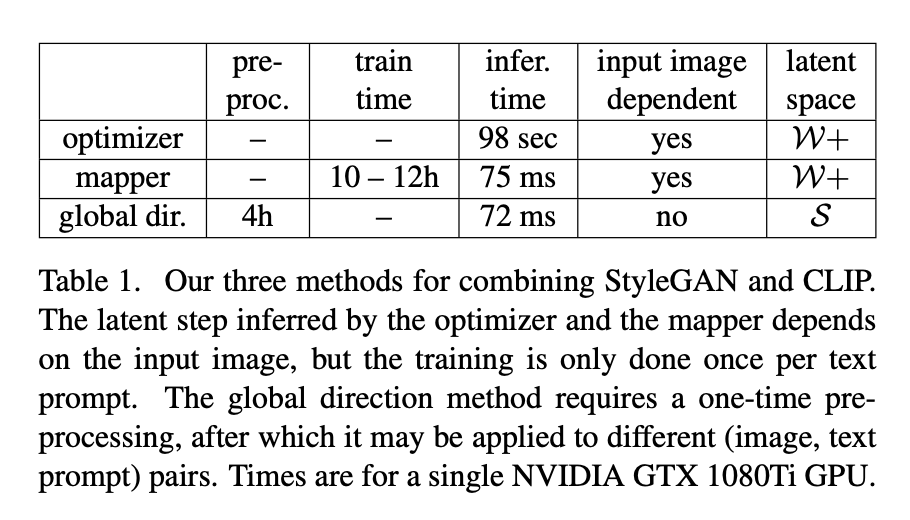

# StyleCLIP: Text-Driven Manipulation of StyleGAN Imagery
- ICCV 2021 Oral
- [Replicate demo](https://replicate.ai/orpatashnik/styleclip)
- 生成：ProGAN，StyleGAN，StyleGAN2(-ADA)，SWAGAN，MobileStyleGAN
- 转码：StyleGAN-Encoder，psp，e4e
- 编辑：StyleRig，StyleFlow，GANSpace，InterFaceGAN，StyleSpace，HiSD，GANsN‘ Roses，SeFa
- 其他：AgileGAN，Label4Free
- 多模态：TediGAN，StyleCLIP，Talk-to-Edit

## CLIP
- Contrastive Language–Image Pre-training (CLIP)
- presented in Learning Transferable Visual Models From Natural Language Supervision
- published by OpenAI in January 2021
- zero-shot learning + NLP + 多模态模型
- 通过400M张网上的未清洗的图片与对应的文字说明，预训练一个语言模型和一个图像分类器
  
- 训练对应的prompt-image对，使矩阵内对应的值最大，矩阵内的值即该对的相似度，例如对角线，CLIP同时训练两个Encoder来最大化相似度
- 预训练完成之后，对于任意一张新图片，对比text embeddings，可以在语料库中找到最适合的描述，一种zero-shot方式
  

## StyleGAN

- 隐空间
  - 图像编辑本质，操作w
  - psp（pixel2style2pixel），e4e(encoder4editing)，图像映射至w+/w*空间，区别在于[1, 512]和[1, 18, 512]

## StyleCLIP
- 用文字表述来对图像进行编辑，inversion + latent code edit
- 现有编辑方法局限性普遍较大
  - 工程手段发现21个向量偏移方向
  - 利用参数化模型检测直线语义信息，3DMM in StyleRig
  - 双向预测解偶w空间，StyleFlow；InterfaceGAN。但只能修改一些年龄、表情等信息
  - SeFa闭环求解模型偏移参数，无监督向量编辑模型
- latent code edit目前大致有两种方法：（1）利用图像的属性标注训练分类器来找到latent paths，这个方法需要标记数据；（2）不需要标记数据，直接找到latent path后（如GANSpace中的PCA）再手工标记每个path代表的方向
- StyleCLIP利用CLIP模型，提出了三种方法来对latent code进行编辑，注意这是三种不同的方法，每种方法都可以进行图像编辑，只是与CLIP结合的形式和耗时不一样。这三种方法如下：
  - Latent Optimization，这个方法利用CLIP模型计算损失，通过对latent code不断迭代达到图像编辑目的，该方法需要迭代很多次，耗时较长。
  - Latent Mapper，这个方法是指定一些提示语言(text prompt)进行训练，模型训练好后只需一次forward可以得到结果，通过指定text prompt，可以预先控制图像编辑的范围区域，这就类似于利用属性分类器来辅助训练，只不过利用CLIP模型可以省略掉分类器。
  - Global Directions，把text prompt通过CLIP映射至S空间

### Latent Optimization
- Eq.1，G(w)与t计算D_CLIP并取argmin，即最接近文本内容的w，第二项确保W+空间内code的相似性，再加入ArcFace人脸识别loss。此处相当于降低w的距离和G(w)的距离。输入图片通过e4e逆向映射，w权重高于G(w)权重。
- Fig.2效果
- 优点：编辑广泛性高
- 缺点：过于浪费时间

### Latent Mapper
- 根据一个特定的t，直接训练一个mapper，输出manipulation step
- 训练3个mapper（coarse，medium，fine）生成残差，加到原始w上，送入StyleGAN。原图映射至w+，对应层级的w送入对应的mapper，编辑原始w，生成新图。
- 三个mapper可以冻结某几个，只训练其他的
- 训练loss采用CLIP的loss，即新图像与文本的相似度，加上偏移向量的L2范数来保护其他固有属性，再加上人脸识别loss
- Fig.4, Fig.5效果
- Fig.5表明可同时操作多属性，先前方法不能做到，by多级编辑器
- 不同输入的编辑，w的偏移距离不固定（由于学习得到），作者将CelebA-HQ的测试集通过e4e转成code，改一波属性，即Table2，发现虽然manipulation step不同，但相似度仍然高

### Global Directions
- High-level idea: 通过$\Delta t$学习映射至S空间的$\Delta s$，达到通过文本全局控制的目的
- 作者认为图像embedding $I$与文本embedding $T$不存在一一映射关系，图像存在大量可修改的visual attributes，文本也可能描述很多图像。考虑$\Delta t$和$\Delta s$，训练两个变化方向使他们相似度更大（拥有更大的余弦相似度）
- Prompt engineering计算$\Delta t$
- Channelwise relevance通过寻找$\Delta s$，embedding至$\Delta i$，满足$\Delta t$的对应关系。得到一系列style code，在c上做偏移操作，得到生成图像偏移向量$\Delta i_c$，投影至正常属性编辑偏移向量$\Delta i$上求期望，得到相关性
- 取某一阈值$\beta$，低于阈值的相关性忽略。高相关性代表了更解缠的属性向量，但是操作度会更低。年龄这种属性可能由发色、皮肤等多属性组合而成，所以设置适当阈值很重要。
- Fig.6 보기
- Fig.7,8效果

### 实验结果
- Latent Optimization耗时且扩展性低，不参与结果对比
- Fig.9 TediGAN vs. Global vs. Mapper，对于人物编辑，Global方法能编辑更多细节特征，但身份没有Mapper明显。Mohawk等难度适中的编辑效果都还行，简单大众效果Global强于Mapper（作者认为原因是W+比S纠缠度更高）
- Fig.10 GANSpace vs. InterFaceGAN vs. StyleSpace vs. Global，Global与StyleSpace效果较好，解缠能力强
- limitations
  - 可编辑图像限制在当前的StyleGAN域内
  - 语义信息限制在CLIP域内
  - 极端操作（drastic manipulation）较难，如老虎容易变狮子，但老虎变狼很难

## Reference
[1] [TowardsDataScience Blog](https://towardsdatascience.com/generating-images-from-prompts-using-clip-and-stylegan-1f9ed495ddda)
[2] [StyleGAN & StyleGAN2 zhihu](https://zhuanlan.zhihu.com/p/263554045)
[3] [StyleCLIP zhihu](https://zhuanlan.zhihu.com/p/368134937)