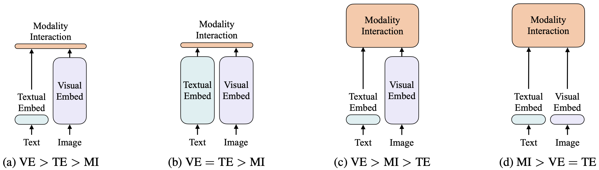

# AIGC - 从GAN到ChatGPT

## 1. Overview
- AIGC，人工智能生成内容
- 发展的根本原因：大模型，大数据，Transformer大一统CV和NLP，算力（GPU）提升，对高效生产力的需求
- AIGC的分类
  
    - 按模型类别划分
        - **单模态模型**：文本生成、机器翻译、图像风格化...
        - **多模态（跨模态）模型**：文本生成图像/语音/视频、图像描述、图像字幕...
    - 按生产内容划分
        - **文本生成**：机器翻译、AI故事生成、ChatBot、...
        - **图像生成**：文本生成图像、文本编辑图像、...
        - **语音生成**：文本生成语音、AI作曲、...
        - **视频生成**：文本生成视频、文本编辑视频、...
        - **其他生成**：代码生成、图谱生成、...
    - 按技术类型划分
        - **有监督生成**：StyleGAN类GAN网络、DALL·E系列、GPT系列、BERT系列、...
        - **One-shot/Few-shot生成（半监督生成）**：人脸驱动（FOMM）、Tune-A-Video、...
        - **RLHF（Reinforcement Learning from Human Feedback）**：Sparrow、InstructGPT、ChatGPT、...
- AI发展史上最疯狂的一个月（2023.2-2023.3）
    - OpenAI年初ChatGPT开放使用
    - 2.9，MetaAI提出ToolFormer，首次使大模型可以联网，相对ChatGPT可以得知新发生的事，而不只是局限于训练数据集中的内容。后续OpenAI也相应提出ChatGPT Plugin，可以连接许多API，如计算器，这样算术题不再需要交给模型推理，防止推理错误
    - 2.24，MetaAI提出LLaMA，650亿参数大规模语言模型
    - 3.8，MS提出Visual ChatGPT，聊天时可以图文并用，也可以根据需求生成图像（文本生成图像）
    - 3.9，MS宣布一周后将发布GPT4，相对前三代的单模态GPT，GPT4是一个多模态模型，且可以处理视频
    - 3.9，POSTECH、卡梅和Adobe提出GigaGAN，一个10亿参数的大型GAN网络，效果和速度全部超过扩散模型，包括Stable Diffusion和DALL·E2
    - 3.13，斯坦福大学提出Alpaca，借助LLaMA-7B并使用Self-Instruct训练Alpaca-7B，效果与OpenAI的text-davinci-003（GPT3.5，175B）持平，参数量降低25倍
    - 3.14，GPT4发布
    - 3.14，Google将自己提出的大语言模型PaLM集成到Google Doc、Google Sheet等workspace中
    - 3.14，Anthropic提出大语言模型Claude，可能是目前ChatGPT最大的竞争对手，主打安全性
    - 3.14，大语言模型公司Adapt.ai公布完成B轮3.5亿美元融资，宣布自研的模型也已接入API，可以使用工具
    - 3.15，做文本生成图像的公司midjourney发布第五代生成模型，效果相当惊艳
    - 3.16，MS公布GPT加持的Copilot，称作“地球上最强大的提升生产力的工具”，可以帮助写邮件、做会议总结、写文档、做ppt等，Office相关的任务可以“人说它做”
    - （3.15，PyTorch发布2.0版本，做了很多很好地优化，这么大个事学术圈没啥人知道，都在看GPT4和Copilot）
    - 直至现在，OpenAI被喷变成CloseAI，因为模型不开源，被微软控制后逐渐以盈利为目的；马斯克等人以及学术界开始争论AIGC模型是否应当停止发展，持续发酵

## 2. AIGC的应用

### 2.1. ChatBot
- 聊天机器人是一种计算机程序，旨在通过基于文本的界面模拟与人类用户的对话。聊天机器人通常使用语言模型以对话方式理解和响应用户查询和输入
- XiaoIce，Microsoft 的一组研究人员和工程师开发，使用了自然语言处理、机器学习和知识表示方面的最先进技术。Xiaoice的一个重要特征是它能够表达同理心，通过使用情感分析方法实现，让小冰像人一样表现。2020 年，谷歌提出了 Meena，这是一个在社交媒体对话上训练的多轮开放域聊天机器人，它实现了最先进的交互式 SSA 分数和困惑度。最近，微软发布了最新版本的 Bing，其中包含 ChatGPT，使用户能够提出开放域或条件问题并通过对话获得结果。这为未来聊天机器人的发展提供了新的可能性
### 2.2. 作画
- 人工智能作画是指使用计算机算法来创作原创艺术作品。这些算法在现有大型图像数据集上进行训练，并使用机器学习技术生成模仿著名艺术家的风格和技巧或探索新艺术风格的新作品。随着扩散模型的快速发展，越来越多的公司推出了新的AIGC作画算法。该领域最著名的是由 OpenAI 推出的 DALL·E 系列。DALL·E，即现在的 Craiyon，最初是在 VQ-VAE 和 CLIP 上构建的，然后diffusion也应用到该技术路线中，并构建 DALL·E2。DreamStudio 由 Stability.ai 创建，是一种文本到图像生成服务，它利用stable diffusion根据给定的短语或句子生成图像。该技术提供与 DALL·E2 相当的性能，但处理速度更快，使其成为许多用户的热门选择。由 Google 开发的 Imagen 在其图像编辑和生成服务中使用扩散模型，并扩展至视频领域中
### 2.3. 音乐
- AIGC音乐生成是指利用深度学习技术和人工智能算法生成新颖原创的音乐作品。AIVA4 是最著名的例子之一，由 Aiva Technologies 于 2016 年开发，可以生成多种风格的音乐片段，包括电子、流行、爵士等，并且可以在各种环境中使用。作为全球首位被交响乐组织认可的人工智能作曲家，AIVA获得了SACEM音乐学会作曲家的全球地位。 OpenAI 在 2020 年开发了 Jukebox 。它在原始音频领域以不同的流派和艺术风格生成带有歌声的音乐。Jukebox 在音乐质量、连贯性、音频样本持续时间以及受艺术家、流派和歌词影响的能力方面被认为是一个飞跃。
### 2.4. 代码
- 基于人工智能的编程系统通常旨在完成代码完成、源代码到伪代码映射、程序修复、API 序列预测、用户反馈和自然语言到代码生成等任务。近年 LLM 将基于 AI 的编程的边界向前推进了一大步。CodeGPT 是由 OpenAI 开发的开源代码生成模型，它与 GPT 系列一样遵循 Transformer 架构，可以针对各种代码生成任务进行微调，例如代码补全、摘要或基于大量源代码数据的翻译。CodeParrot 是一个编程学习平台，在编码过程中为用户提供个性化的反馈和帮助，以渐进式人机交互的方式设计了各种交互练习和编程挑战。Codex 在更大、更多样化的数据集上进行了训练，旨在从头开始生成完整的编码程序
### 2.5. 教育
- AIGC 有可能通过利用多模态数据（例如教程视频、学术论文和其他高质量信息）在教育方面取得重大进展，从而改善个性化教育体验。在学术方面，Google Research 引入了 Minerva，它建立在 PaLM 通用语言模型和一个额外的以科学和数学为中心的数据集之上，以解决大学水平的多步定量任务，涵盖代数，概率论、物理学、数论、初等微积分、几何学、生物学、电气工程、化学、天文学和机器学习。Minerva 通过组合技术在推理任务上实现了最先进的性能，包括少量提示、思维链或便签本提示以及多数表决。商用方面，巧匠教育科技宣布将开发一款基于AIGC的自​​动课程、AI导师、在线教育自适应学习的班级机器人产品，预计2023年第四季度出货。

## 3. AIGC核心技术
### 3.1. AIGC发展历程
- NLP的前Transformer时代的AIGC
    - 隐马尔可夫模型（Hidden Markov Models，HMMs）和高斯混合模型（Gaussian Mixture Models，GMMs），最早的序列数据生成模型，如语音和时间序列，性能很低
    - N-gram语言建模，用于句子生成的统计模型，通过学习单词分布搜索最佳序列，但不能适应长句子
    - 循环神经网络（Recurrent Neural Network，RNNs），适应更长的句子，但易产生梯度消失和梯度爆炸问题
    - 长短期记忆网络（Long-Short Term Memory，LSTM）和门控记忆单元（Gated Recurrent Unit，GRU）一定程度解决了上述问题，但是仍然无法做到并行计算，缺失长距离依赖
- CV的前Transformer时代的AIGC
    - 纹理合成（Texture Synthesis）和纹理映射（Texture Mapping），提取已有的大量图像纹理特征合成新纹理图像，这类算法基于手工设计的特征，生成复杂多样图像的能力有限
    - 生成对抗网络（Generative Adversarial Networks，GANs），借助二人博弈的思想，生成逼真的样本，深度学习和AIGC的重要里程碑，在各种应用中表现出色
    - 变分自编码器（Variational Auto-Encoder，VAE），另一里程碑，使用了连续的概率分布来建模隐变量，可以更好地捕捉数据的连续性和多样性，更适合生成连续的、高维的数据
    - 扩散模型（Diffusion Model），一种基于概率推断的图像生成方法，其主要思想是通过逐步扩散噪声向量来生成图像。它可以看作是对随机游走的概率建模，通过将噪声向量进行多次扩散，每次扩散后逐渐逼近目标图像的分布
- NLP与CV的交叉点-Transformer的大一统
    - 一种基于注意力机制的神经网络架构，主要用于自然语言处理和其他序列到序列的任务，是目前最先进的序列建模技术之一
    - 在NLP领域的大模型中，包括BERT和GPT，都采用Transformer架构作为它们的主要构建块，与以前的构建块（即 LSTM 和 GRU）相比具有优势，可以高效并行计算并解决长距离依赖问题
    - 在CV领域，Vision Transformer (ViT)和Swin Transformer后来通过将Transformer架构与视觉组件相结合，达到了比传统CNN更佳的效果
- 后Transformer时代的AIGC
    - Transformer对多模态学习的贡献：传统的多模态学习方法主要是将不同模态的数据输入到不同的网络中进行处理，再将结果进行融合，而Transformer可以通过自注意力机制将不同模态的数据进行交互式处理，从而更好地利用不同模态之间的相关性。如CLIP、ALBEF等模型，将不同模态之间的特征均使用Transformer映射至同一特征空间，进而学习多模态信息
    - 逐步产生一些新的训练技术，prompt learning、自监督学习、RLHF等，取代仅微调finetune
- 硬件的发展也推动了AIGC的发展
    - NVIDIA A100 GPU 在 BERT-large 推理期间的速度是 V100 的 7 倍
    - 谷歌专为深度学习而设计张量处理单元 (TPU) 
    - 分布式训练、云计算、大型 GPU 或 TPU 集群
---
- AIGC里程碑模型发展历程
  
- 模型参数量与算力的发展
  
### 3.2. AIGC单模态模型
#### 3.2.1. 生成式语言模型

- 根据输入数据中的模式和结构生成可读的人类语言，可用于广泛的 NLP 任务，例如对话系统、翻译和问答
- 预训练语言模型的使用已成为 NLP 领域的主流技术，当前最先进的预训练语言模型可分为屏蔽语言模型（编码器）、自回归语言模型（解码器）和编码器-解码器语言模型
- 解码器模型广泛用于文本生成，而编码器模型主要应用于分类任务。通过结合这两种结构的优势，编码器-解码器模型可以利用上下文信息和自回归属性来提高各种任务的性能
##### 编码器模型

- BERT在NLP任务中，首次可以用一个大的数据集训练好一个深的神经网络，然后应用在很多其他NLP任务上，简化了NLP任务的训练，又提升了性能
- 语言理解任务的深度双向Transformer，GPT是一个单向模型，现在预测未来，而BERT双向在于过去和未来同时包括。ELMo是双向模型，不过用的是较老的双向RNN。本文在二者之上构建双向Transformer架构的BERT
- 单向模型的局限性：对于QA这种token-level的任务，希望看完整个句子来选答案，因此需要全局信息，即双向信息。BERT解除单向的限制，用到的是MLM，masked language model，相当于完型填空，每次随机选一些token给mask住，然后目标函数是预测被mask的token。MLM相当于允许使用左侧和右侧信息，成为双向模型。此外，还使用next sentence prediction，即给出两个句子来预测原文中是否是相邻的，以此学习句子层面的信息
- RoBERTa（Robustly optimized BERT approach）等后续方法，使用了一些优化策略，包括动态掩码、连续文本块采样和大批量训练等，更好地利用了大规模文本数据，并有效地缓解了过拟合问题，从而使模型在多项NLP任务上表现更好
##### 解码器模型
- GPT系列：利用自注意力机制同时处理序列中的所有单词，GPT 接受了基于先前单词的下一个单词预测任务的训练，使其能够生成连贯的文本
    - GPT：OpenAI于2018年发布的第一个预训练语言模型，包含了12个Transformer编码器。该模型是基于单向的语言模型训练方式预训练得到的，可以完成自然语言生成、文本分类等任务。GPT在自然语言生成领域取得了一定的成功，但在大规模自然语言理解方面效果不佳
    - GPT2：2019年推出的预训练语言模型，具有更大的规模和更强的生成能力。GPT2的模型参数量比GPT1增加了10倍，包含了48个Transformer编码器，可以生成更长、更连贯、更有逻辑的文本
    - GPT3：2020年发布的预训练语言模型，规模比GPT2更大，包含了1750亿个参数。GPT3相较于之前的版本，最大的不同在于其拥有更高的自适应能力，能够在没有经过特定任务训练的情况下完成很多自然语言处理任务，如问答、文本分类等。GPT3还拥有大量的先验知识，并能够从输入中自动提取出相应的信息，具有更好的泛化性能
    - GPT3.5：在2021年发布的模型，规模比GPT-3更大，包含了了超过3000亿个参数。GPT-3.5相对于GPT-3的主要改进在于使用了更高效的模型并行技术和更智能的权重分配策略，可以更好地利用GPU的性能
    - GPT4：2023年，尚未完整公布，多模态生成模型
- Gopher使用类似 GPT 的结构，将 LayerNorm 替换为 RSNorm，加入残差连接并优化了注意力层；BLOOM 与 GPT3 具有相同的结构，但 BLOOM 没有使用稀疏注意力，而是使用全注意力网络，更适合建模长依赖关系；Megatron是由NVIDIA开发的大规模语言模型训练框架，扩展了常用的架构，提升运算效率
- InstructGPT

##### 编解码器模型
- BART，全称为Bidirectional and Auto-Regressive Transformer，是由Facebook AI研究团队于2019年提出的文本生成模型。BART结合了自编码器和解码器的特点，既可以进行生成任务，也可以进行填充任务和文本重构任务。BART在多项任务上均取得了顶尖水平的结果，包括摘要生成、机器翻译、问答、命名实体识别等
- T5，全称为Text-to-Text Transfer Transformer，是由Google Brain团队于2019年提出的基于Transformer结构的文本生成模型。T5通过将不同的任务表示成文本到文本的转换问题，利用大规模的文本数据集进行端到端的训练，实现了对多种自然语言处理任务的统一建模。T5在多个任务上都取得了顶尖水平的成果，包括机器翻译、语言推理、摘要生成、问答和文本分类等
- 相比之下，T5更加注重模型的泛化能力和可扩展性，可以用相同的模型结构和训练方法应对多个任务，而BART则更注重模型的表征能力和生成效果，可以生成高质量的自然语言文本。此外，T5在输入和输出端都采用了前缀表示法，可以更方便地处理不同的任务，而BART则采用了双向编码器和自回归解码器，可以更好地处理长序列的文本生成任务
#### 3.2.2. 生成式视觉模型

- ProGAN, BigGAN, StyleGAN, SWAGAN, StyleGAN2, StyleGAN3
- VAE：假设数据的潜在空间表示服从高斯分布，因此需要学习两个参数：均值向量和协方差矩阵。为了让生成的数据更接近真实数据，VAE使用了一种重构误差的损失函数，同时引入了KL散度（Kullback-Leibler Divergence）作为正则项，使得潜在空间的分布更加接近标准正态分布
- 归一化流：将简单的概率分布通过一系列复杂的可逆和可微函数变换映射到目标分布，从而生成与目标分布相似的样本
    - Coupling and Autoregressive Flows
    - Convolutional and Residual Flows
- 扩散模型：前沿的基于概率的生成模型，目前的sota，工作原理是通过多级噪声扰动逐步破坏数据，然后学习反转此过程以生成样本
    - DDPM分别应用两个马尔可夫链来逐步破坏具有高斯噪声的数据，并通过学习马尔可夫转移核来逆转前向扩散过程。基于分数的生成模型 (SGM) 直接作用于数据对数密度的梯度（得分函数）
    - NCSN用多尺度增强噪声扰动数据，并通过以所有噪声水平为条件的神经网络联合估计所有此类噪声数据分布的得分函数
    - Score SDE将前两个公式概括为连续设置，其中噪声扰动和去噪过程是随机微分方程的解。此外，概率流 ODE 也可以用来模拟逆向过程

### 3.3. AIGC多模态模型
多模态生成是当今 AIGC 的重要组成部分。多模态生成的目标是通过学习数据中的多模态连接和交互来学习生成原始模态的模型。模态之间的这种联系和相互作用有时可能非常复杂，这使得与单模态表示空间相比，多模态表示空间难以学习。
#### 3.3.1. 视觉语言生成
- AIGC多模态模型中研究最广泛、前景最广阔的领域。近年来，用于单一模态的编码器模型取得了显著进步，引发了如何从多种模态中学习上下文表示的问题。目前编码器模型可以分为两类，级联编码器和交叉对齐编码器，即单塔和双塔结构。单塔直接在Transformer编码器内部学习跨模态特征，双塔通过外部的约束条件进行交互（如CLIP的dual encoder）

##### 单塔编码器结构
- VisualBERT，使用BERT作为文本编码器，ResNet作为图像编码器。来自图像编码器的嵌入将直接合并到 BERT 的token嵌入中

- VL-BERT，使用 Faster R-CNN 作为感兴趣区域 (ROI) 提取器，并利用提取的 ROI 信息作为图像区域嵌入。VL-BERT 还包括一个额外的预训练任务，即带有语言线索的mask ROI 分类，以更好地结合视觉信息

- UNITER，与VisualBERT架构相同，设计了新的多任务训练

##### 双塔编码器结构
- 每个模态一个塔，然后使用交叉模态编码器学习联合表示空间
- LXMERT，使用 Transformers 提取图像特征和文本特征，添加多模态交叉注意力模块进行协调学习

- ViLBERT

##### 文本解码器
- 图像到文本解码器，通常从编码器获取上下文表示，并将该表示解码为句子。随着大型语言模型的出现和有效性的验证，许多架构现在选择性地冻结语言解码器组件。因此，文本解码器可以大致分为两类：联合训练解码器和冻结编码器

- 联合训练解码器：联合训练的解码器是指在解码表示时需要完整的交叉模式训练的解码器。图像本到文本生成的挑战通常在于在预训练期间如何对齐两种模式。因此，这类模型需要更强大的编码器而不是解码器。为了应对这一挑战，许多模型优先构建强大的编码器，然后将其与相对轻量级的解码器模型相结合
    - CLIP（Contrastive Language-Image Pre-Training）
    
    - ALBEF（Align before Fuse）
    
    - BLIP（Bootstrapping Language-Image Pre-training for Unified Vision-Language Understanding and Generation）
    
    - 不同类型的多模态交互模型（哪种最好仍是一个较有争议的问题，认同c的更多）
    
- 冻结解码器：冻结大型语言模型并仅训练图像编码器。生成的图像表示将嵌入到语言模型的输入嵌入中。该方法在各种零样本和少样本视觉语言任务中实现了最先进的性能
    - Flamingo，利用门控交叉注意力密集层将图像表示融合为文本表示
##### 图像解码器
- 文本生成图像工作
- 基于GAN的解码器
    - StackGAN，AttnGAN，StyleGAN，StyleCLIP
- 基于扩散的解码器
    - GLIDE将消融扩散模型 (ADM) 引入到文本到图像的生成中，与之前基于扩散的方法相比，GLIDE 使用具有 3.5B 参数的更大模型和更大的成对数据集，在许多基准测试中取得了更好的结果
    - Imagen将冻结的 T5 语言模型与超分辨率扩散模型相结合
    - DALL·E2用于图像生成和编辑任务。虚线上方是CLIP预训练过程，旨在对齐视觉和语言模态。虚线下方是图像生成过程。文本编码器接受指令并将其编码为表示，然后先验网络和扩散模型解码该表示以生成最终输出
    

#### 3.3.2. 文本语音生成
##### 文本音频生成
- 将书面文本转换为口头语音或将人类语音准确转录为机器可读文本的过程（如营销号视频配音），虽然也属于AIGC领域，但是技术类型不同（使用非Transformer或非深度学习方法）
- AdaSpeech通过在梅尔谱解码器中利用两个声学编码器和条件层归一化，使用有限的语音数据有效地定制高质量的新语音；Lombard利用频谱整形和动态范围压缩在存在噪声的情况下生成高度清晰的语音。Cross-Lingual Generation 是一个有影响力的跨语言语音传输工作
##### 文本音乐生成
- t2m: JTAV学习社交媒体内容，使用跨模态融合和专注池技术融合了文本、听觉和视觉信息
- m2t: MusCaps，一种音乐音频字幕模型，通过多模态编码器处理音频文本输入并利用音频数据预训练来生成音乐音频内容的描述，以获得有效的音乐特征表示
- 多模态预训练：CLAP，一种从自然语言监督中学习音频概念的方法，它利用两个编码器和对比学习将音频和文本描述带入联合多模态空间

#### 3.3.3. 文本图生成
- 文本图生成是另一个重要的多模态主题，可以在很大程度上释放 NLP 系统的潜力，因为自然语言文本本质上是模糊的，因为它携带了各种冗余信息，而且逻辑组织也很弱。同时，有利于机器处理结构化、组织良好和压缩形式的内容。知识图谱（KG）是语言处理系统中将语义内部状态之间的关系反映为图结构的结构化意义表示。并且越来越多的作品从文本中提取 KG 以辅助文本生成，这些文本包含跨多个句子的复杂思想
##### 文本到知识图谱生成
- KG-BERT，CycleGT，DualTKB，Grapher
##### 知识图谱到文本生成
- GTR-LSTM，DUALENC，GAT，HetGT

##### 文本分子生成
- Text2Mol，MolT5，MoMu

#### 3.3.4. 文本代码生成
- 文本代码生成旨在从自然语言描述中自动生成有效的程序代码或提供编码辅助
##### 条件文本编程代码生成
- CodeBERT，CuBERT，CodeT5，PLBART
##### 交互式编程系统
- CODEGEN，TDUIF

## 4. 里程碑模型（待详细调研）
- GPT3, ChatGPT, GPT4, ToolFormer, LLaMA, Visual ChatGPT
- DALL·E, DALL·E2, Imagen, NUWA, Stable Diffusion
- Muse, Dream Fusion, Magic3D, Flamingo, VisualGPT
- Soundify, AudioLM, Jukebox, Whisper
- LAMDA, PEER, Codex, AlphaCode, Alphatensor
- ...

## 5. 未来的发展方向
- 视频相关的AIGC（如文本生成视频），仍然存在待提升和待解决的难题，并且视频生成应用前景更广
- 多模态模型大一统，即多合一的多任务模型，如NUWA，Transformer vs. Diffusion
- 在其他领域的应用，如金融服务、医疗保健、自动驾驶、science discovery等
- 域内数据集 vs. 网络数据集，到底哪种更利于模型学习知识，仍然存在一定争议
- 模型的持续学习能力（如RLHF），人类知识库不断扩大，新任务不断涌现，何时应该选择持续学习策略以及何时选择再训练策略是一个关键问题。此外，从头开始训练AIGC模型开销巨大，因此 AIGC 下一代基础模型的模块化设计可能会阐明模型的哪些部分应该重新训练
- 目前AIGC类的模型全部过于庞大，轻量化和模型加速也是一个关键研究方向