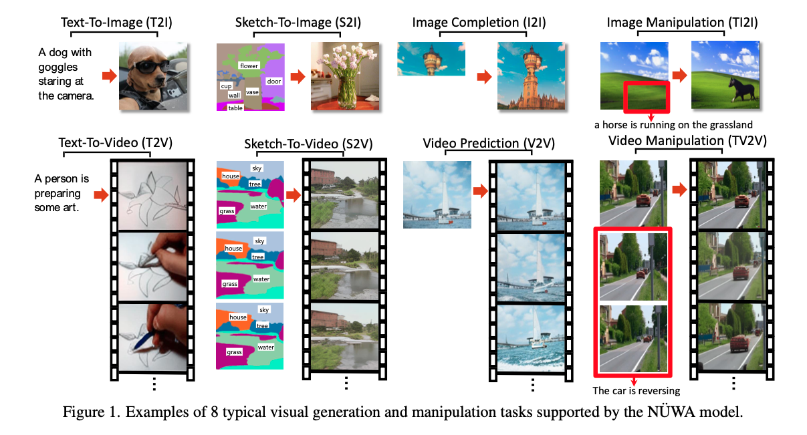

# NUWA: Visual Synthesis Pre-training for Neural visUal World creAtion
- 一个8合1任务模型，针对视觉生成与编辑任务
- 设计一个3D transformer编解码器，将视频看作3D数据，同时适配文本（1D数据）和图像（2D数据）
- 引入3DNA（3D临近注意力机制）减少计算量

## Introduction
- 将图像和视频的生成任务统一到一个网络结构中，提出NUWA
- 一个统一的多模式预训练模型，可以处理八种任务，Fig.1
    - T2I, Text-To-Image
    - T2V, Text-To-Video
    - S2I, Sketch-To-Image
    - S2V, Sketch-To-Video
    - I2I, Image Completion, 图像的一部分生成整张图
    - V2V, Video Prediction, 输入图像当作首帧，预测后序帧变成视频
    - TI2I, Image Manipulation, 文本引导的图像编辑
    - TV2V, Video Manipulation, 文本引导的视频编辑

- 本文贡献
    - 提出NUWA，一个统一的3D transformer编解码器结构，可同时处理文本、图像、视频的生成任务
    - 提出3DNA，3D临近注意力机制，同时考虑时间和空间的局部特征，以减少计算量，提升生成质量
    - NUWA达到了多种任务的SOTA，并且意外的在TI2I、TV2V中具有零样本能力

## Related Works
- Auto-regressive模型只能应用于低分辨率任务
- 基于VQ-VAE的方法只能单一针对图像或视频训练，因此只能完成一项任务
- NUWA是一个统一自回归视觉生成模型，同时通过图像和视频进行训练，并且可以迁移至多种下游任务

## Method
- 3D数据表示
    - 统一用$X \in \mathbb{R}^{h \times w \times s \times d}$表示文本、图像、视频、sketches，其中$h$和$w$表示空间轴的tokens的数量，$s$表示时间轴的tokens的数量，$d$表示各token的维度
    - 文本利用lower-cased byte pair encoding (BPE)来切片，并embed至$\mathbb{R}^{1 \times 1 \times s \times d}$，仅有时间信息没有空间信息
    - 利用VQ-VAE的改进版VQ-GAN进行切片和embed，表示为$\mathbb{R}^{h \times w \times 1 \times d}$，仅有空间信息没有时间信息
    - 视频类似，$\mathbb{R}^{h \times w \times s \times d}$，同时包含时序和空间信息，$h$和$w$即embed后的高和宽，$s$即帧的数量
- 3DNA
    - 基于之前提出的3D数据表示，提出一个统一的3D临近自注意力模块
    - 同时支持自注意力和交叉注意力，Eq.6
    - $Q$用$X$计算，$K$和$V$用$Q$-$neighbor$计算
    - 减少了计算量
- 3D编解码器
    - 位置编码方式根据3DNA修改，添加偏置量
- 训练方式
    - 只基于T2I、V2V、T2V三个任务训练
    - 全部采用交叉熵
    - V2V加入“None”当作假输入，统一交叉熵

## 实验结果
- 三任务数据集
- 64块A100 GPU（80GB显存，英伟达针对数据中心的高性能计算机推出），训练两星期