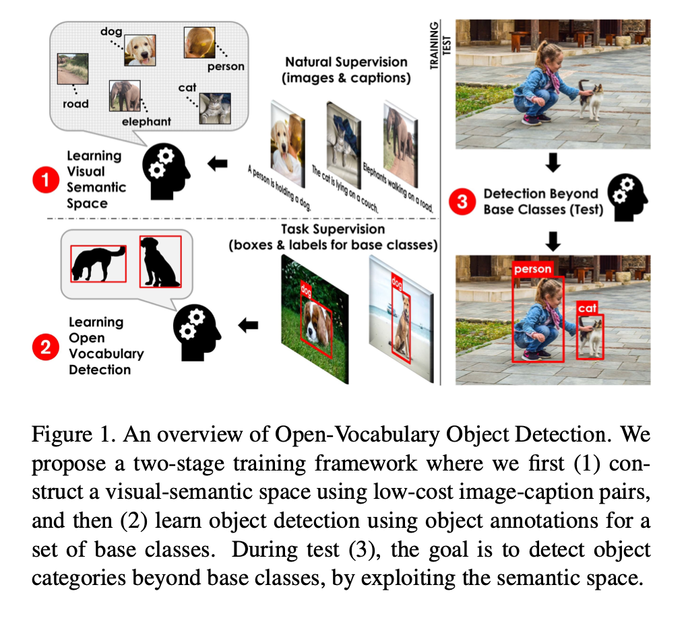
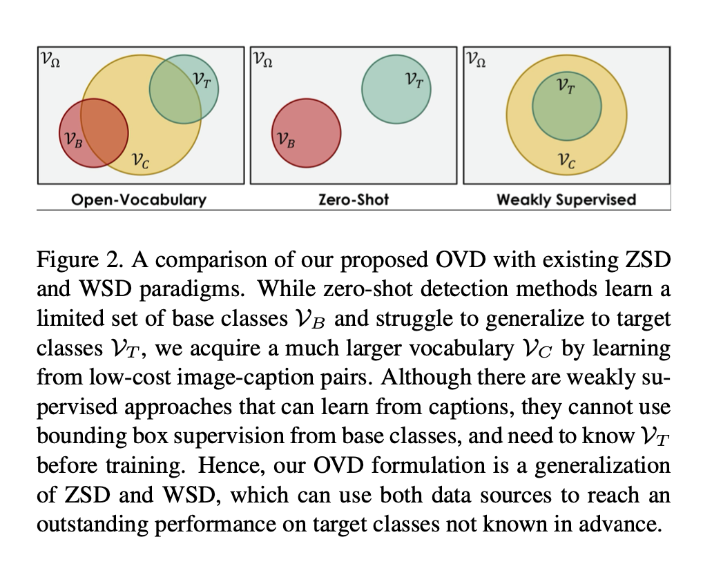

# OVR-CNN

- Open Vocabulary Object Detection Using Captions
- open vocabulary CNN
- CVPR 2021
- OVR-CNN论文：Zareian_Open-Vocabulary_Object_Detection_Using_Captions_CVPR_2021_paper.pdf
- 代码：https://github.com/alirezazareian/ovr-cnn

## Introduction
- 传统CNN目标检测仅局限于训练数据集，很难直接迁移至新类别
- 可以借助若监督方法或zero-shot学习，但现有效果不佳
- 借助开放词表，效果优于若监督和zero-shot
- Faster RCNN等传统CNN方法，需要人工标注大量数据，且检测类别有限，训练也较耗时
- 考虑人对目标检测的认知，人一般是通过语言描述来学习物体的，基于此提出开放词表目标检测（OVD）
- 两阶段检测框架，如图1

- 首先使用 image-caption pairs (图像-文本对)的语料库来获取 unbounded vocabulary (无界词汇表) ，构成 visula-semantic space，然后使用这些知识来学习目标检测(或任何其他下游任务)。比如说检测类任务，只需要学习一部分带注释的基类，后续就可以目标检测到新类。

- ZSD通常是学习训练数据的属性，然后得到融合特征，达到zero-shot的效果。通常的zsd setting是将trainable classifier换成fix word embedding，这样不管是base类的word embedding还是target类的word embedding都是在同一个embedding space里面，可以在转换测试类别时直接跟visual feature算相似度。但是作者指出了跟DSES同样的问题，在稀疏采样的base类上做对齐可能造成过拟合，因此作者提出了在更加密集的文本类采样空间里学习visual-text对齐，帮助视觉特征学习更加完整的语义信息，跟DSES引入dense类别的外部数据集不同，OVD还是用coco，只是用了粗粒度的image-caption标注，这样不用关心target类信息是否包含在caption标注里面，不用人为做一系列剔除等的预操作，更加general一些。
- 本文提出的OVD介于ZSD和WSD之间，一阶段开放词表学习分类（解决ZSD对未知类别学习信息少、检测效果差的问题），二阶段目标检测学习检测定位（解决WSD定位差的问题）
- **只需提供图像，即可进行目标检测，不需给出captions**

## 网络
- 基于zero-shot训练的Faster R-CNN
- zero-shot的做法由于基类过少，很容易导致过拟合。因此作者先训练视觉语义空间，再运用到下游任务，可以有效防止过拟合
- 整个模型的架构跟Faster R-CNN几乎完全一样，只是将最后的cls head换成了v2l（也就是换成了一个将visual feature投影到word embedding space的投影矩阵），所以其实文章的核心就是在训练这个投影矩阵
- 视觉语义空间学习
    - zero-shot学习一种训练类别的embedding来代替传统目标检测中的检测头，但是很容易过拟合，且必须保证embedding空间是连续的
    - 最终目标是，将V2L的embedding和word embedding对齐，类似PixelBERT的思路，由此训练V2L
    - 输入图像，输出32x32个区域的特征向量，经过V2L生成embedding（V2L利用图像patch训练，目的是匹配在二阶段接收ROI），和word embedding对比距离来训练V2L，BERT可融合上下左右文的信息，能生成更高语义的深层次的双向语言特征，加强词和图像区域的对应关系
    - 作者认为这种弱监督方式可能使得模型只学到能正确匹配视觉-文本的最少信息量，陷入局部最优（可能类似于是学一些简单的先验信息就能完成这个任务，比如出现啥单词，啥视觉概念就会将他们匹配到一起），学到的v2l会丢失很多语义信息。因此有了后面的multimodel transformer，主要是通过完成MLM（就是掩码单词预测，只不过利用多模态信息，应该就是希望经过v2l的变换后也能尽可能保留视觉信息来帮助补全单词）和ITM（image-text match，也就是再输出一次匹配分数，不是很懂这个存在的意义，可能就是为了直接用pixelbert）
    - 这一步的目的就是训练好V2L模块，其中word embedding和BERT参数是固定的，ResNet、V2L和Multi-model Transformer是可训练的
- 开放词表检测学习
    - 整体训练方式类似于Faster R-CNN，检测头分类分支替换成V2L和word embedding的匹配
    - 固定ResNet、V2L和word embedding的参数，background加入word embedding中设一个阈值来判断前后景

## Reference
- [zhihu](https://zhuanlan.zhihu.com/p/419255664)
- [CSDN](https://blog.csdn.net/weixin_46239293/article/details/122222633)