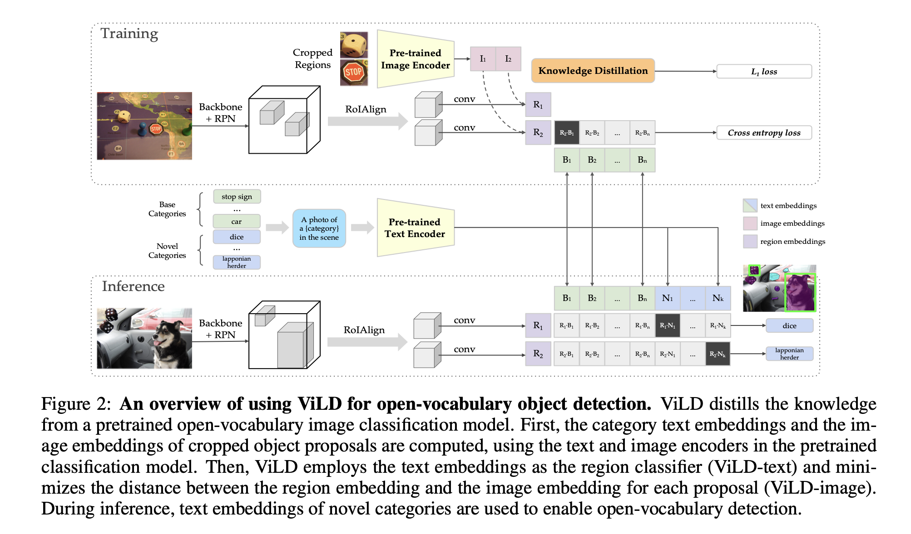
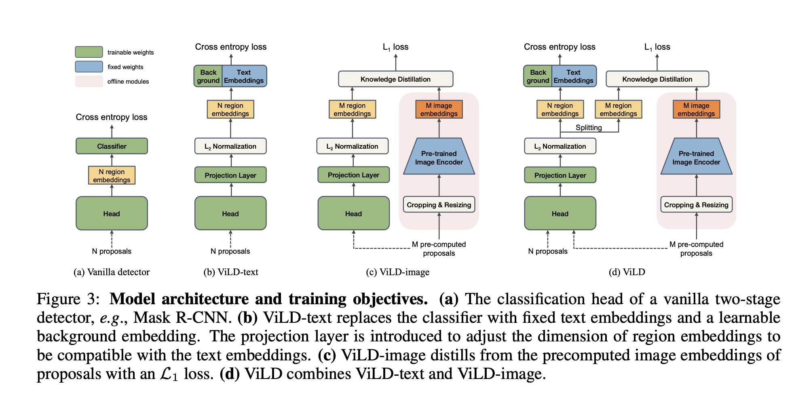

# ViLD

- Open Vocabulary Detection via Vision and Language Knowledge Distillation
- Google
- ViLD论文：https://arxiv.org/abs/2104.13921v2
- 代码：https://github.com/tensorflow/tpu/tree/master/models/official/detection/projects/vild

## 介绍
- 开放词表目标检测，目标是通过任意文本输入实现目标检测
- 这类任务问题在于训练数据种类不够多，并且很难扩张至更多类
- 本文利用知识蒸馏，将一个预训练开放词表图像分类教师网络，蒸馏至两阶段学生检测器
- 教师网络将种类文本和检测框编码，编码信息用于训练学生检测器
- 模型可以很好的迁移至其他数据集，不需要微调
- 目标检测伴随长尾问题，可以将长尾当作novel类别，一并实现开放词表目标检测
- 开放词表目标检测分为两步，生成检测框proposal，然后进行开放词表图像分类，但问题在于，每个proposal需要一个一个进行分类，导致单张图像推理速度非常慢。因此借助例如CLIP，比对embed的信息
- ViLD包括了三部分，新目标物体定位、ViLD text embeddings和ViLD image embeddings。text用种类名称送入编码器获得embeddings，然后用于分类图像区域。image将proposal送入编码器。两个embeddings联合训练
- 教师网络借助ALIGN(Jia et al., 2021)，最终蒸馏后效果达到SOTA
- CLIP是输入图像输出文本分类，ViLD是输入文本输出图像检测框

## 网络模型

- overview
    - ViLD从一个预训练的开放词表图像分类网络蒸馏
    - 首先计算text和cropped object proposals的embeddings，借助教师预训练网络
    - 然后文本编码器训练完成，最小化与每一个proposal的距离
    - 预测阶段，新种类的编码用于实现开放词表检测（应该是将标签提前按照长尾划分成base和novel）
- 新类别proposal
    - 采用两阶段检测器，如MaskRCNN
    - 去掉bbox回归和mask预测层，改为class-agnostic模块
    - 对于每一个ROI，对于所有类别只预测一个bbox和mask，而不是每个类别预测一个

- 带裁剪区域的开放词表检测
    - image embeddings借助base类别训练并离线提取ROI，裁剪成两种维度（1和1.5倍）参与计算，因为1.5包含了更多信息
    - text embeddings将类别语句送入并离线生成
    - 计算两个embeddings的余弦相似度，softmax激活，再接一个per-class的NMS得到最终检测结果
    - 推理速度很慢，因为每一个ROI都要预测
- ViLD
    - 解决推理速度问题

- Model ensembling

## 实验
- 采用CLIP当作开放词表分类模型
- Benchmark on LVIS and COCO
- 在训练时，让模型同时接触base类和novel类，效果会更好（AR指标更高）
- ALIGN做教师网络
- 文本和图像双重embedding比文本embedding+图像crop的方式指标要高很多